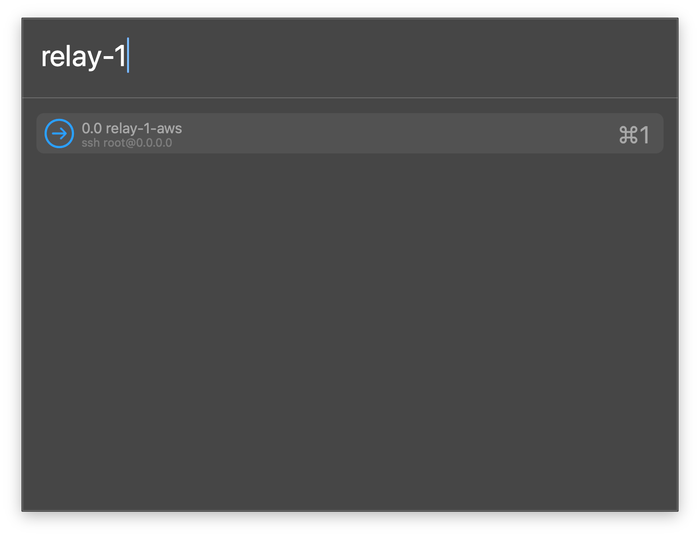

# cmux-pick

[](https://github.com/jhammond045/cmux-profiles/actions/workflows/luacheck.yml)

An [iTerm2 Profiles](https://iterm2.com/documentation-dynamic-profiles.html)-style
launcher for the [cmux](https://cmux.com) terminal, built as a
[Hammerspoon](https://www.hammerspoon.org) Spoon.

Press a hotkey, get a fuzzy-search modal of your saved sessions, hit Enter, and
the profile opens in a new cmux workspace running its command (usually `ssh …`).
It reads the **same JSON format iTerm2 uses for dynamic profiles**, so you can
point it at a profiles file you already maintain.



- **Enter** → open the profile in a new workspace.
- **Shift+Enter** → open it as a split ("tab") in the current workspace.

## Requirements

- macOS
- [cmux](https://cmux.com) (the native terminal app)
- [Hammerspoon](https://www.hammerspoon.org) — `brew install --cask hammerspoon`
  (grant it Accessibility permission on first launch)

## Install

```bash
git clone https://github.com/jhammond045/cmux-profiles.git
cd cmux-profiles
./install.sh
```

`install.sh` links `CmuxPick.spoon` into `~/.hammerspoon/Spoons/`, seeds a config
at `~/.config/cmux-pick/profiles.json`, and adds the loader to your
`~/.hammerspoon/init.lua`. Then:

1. **Enable socket access in cmux** — Settings → allow external processes
   (`CMUX_SOCKET_MODE = automation`). Without this, launches fail with `exit 15`,
   because Hammerspoon isn't a process cmux spawned itself.
2. Reload Hammerspoon (menu bar → *Reload Config*).
3. Focus cmux, press **Cmd+O**.

### Manual install

Copy or symlink `CmuxPick.spoon` into `~/.hammerspoon/Spoons/`, then add to your
`init.lua`:

```lua
hs.loadSpoon("CmuxPick"):start()
```

Or grab `CmuxPick.spoon.zip` from the
[latest release](https://github.com/jhammond045/cmux-profiles/releases/latest),
unzip, and double-click `CmuxPick.spoon` to install it into Hammerspoon. (You
still need to create `~/.config/cmux-pick/profiles.json` — copy
[`examples/profiles.example.json`](examples/profiles.example.json).)

## Profiles

Profiles live in a JSON file (default `~/.config/cmux-pick/profiles.json`) in
iTerm2 dynamic-profile shape. Only a few fields are used:

```json
{
  "Profiles": [
    { "Name": "prod web (ssh)", "Command": "ssh deploy@prod-1.example.com", "Custom Command": "Yes", "Tags": ["prod"] },
    { "Name": "local project",  "Working Directory": "~/code/myapp", "Tags": ["local"] }
  ]
}
```

| Field | Meaning |
|-------|---------|
| `Name` | Shown in the picker; becomes the workspace name. |
| `Command` | Command to run (with `"Custom Command": "Yes"`). Usually `ssh …`. |
| `Custom Command` | `"Yes"` to run `Command`; otherwise a plain shell. |
| `Working Directory` | `cwd` for the session. `~` is expanded. |
| `Tags` | Shown next to the command and searchable. |

A bare top-level array (`[ {…}, {…} ]`) also works. Typing in the picker matches
the name, the command, and the tags.

**Already keep an iTerm2 dynamic-profiles file?** Point cmux-pick straight at it
instead of maintaining a second copy:

```bash
ln -sf ~/Library/Application\ Support/iTerm2/DynamicProfiles/yours.json \
       ~/.config/cmux-pick/profiles.json
```

The file is re-read every time you open the picker, so edits show up immediately.

## Configuration

Pass an options table to `start()`:

```lua
hs.loadSpoon("CmuxPick"):start({
  profiles   = "~/dotfiles/cmux-profiles.json",  -- profiles JSON path
  app        = "cmux",                           -- cmux's macOS app name
  splitDir   = "down",                           -- down | up | left | right
  hotkeyMods = { "cmd" },                        -- hotkey modifiers
  hotkeyKey  = "o",                              -- hotkey key
  global     = false,                            -- true = summon from any app
  -- cmuxBin = "/path/to/cmux",                  -- override CLI auto-detection
})
```

All options are optional; the defaults match the install steps above.

If **Cmd+O** does nothing, your cmux app may register under a different name —
check it in the Hammerspoon console with
`hs.application.frontmostApplication():name()` (with cmux focused) and set
`app = "…"` accordingly. Or set `global = true` to bind the hotkey everywhere.

## How it works

cmux ships a CLI that talks to the running app over a Unix socket. cmux-pick
shells out to it:

- **Enter** → `cmux new-workspace --name … --cwd … --command … --focus true`
  (one call; cmux runs the command in the new workspace, no race).
- **Shift+Enter** → `cmux new-split <dir> --workspace <current> --focus true`,
  then `cmux send --surface <new> "<command>\n"` (split has no `--command`).

The picker is a native `hs.chooser`. Because `hs.chooser` can't report which
modifier was held on selection, Shift+Enter is caught by an `hs.eventtap` that's
active only while the modal is open. (Cmd+Enter is intercepted by macOS before
it reaches the chooser — it just beeps — which is why the split is on Shift.)

## Troubleshooting

| Symptom | Cause / fix |
|---------|-------------|
| Launch alert `exit 15` | Socket closed to external processes. Enable automation mode in cmux Settings. |
| "cmux CLI not found" | cmux not installed, or in a non-standard location — set `cmuxBin`. |
| Cmd+O does nothing | Wrong `app` name (see above), or Hammerspoon lacks Accessibility permission. |
| "couldn't read selection" on Shift+Enter | Old Hammerspoon — `brew upgrade --cask hammerspoon`. |
| Picker empty | Bad/missing profiles file — check the path and JSON. |

## Development

`luacheck` runs in CI on every push (`.github/workflows/luacheck.yml`). Run it
locally with `luacheck .`.

## License

MIT — see [LICENSE](LICENSE).
